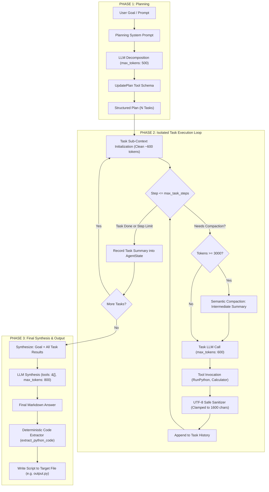

# 🦀 Autonomous Rust Agent Runtime
### High-Performance, Context-Managed Agentic AI Engineered from Scratch in Rust

[](https://www.rust-lang.org)
[](https://tokio.rs)
[](https://ollama.ai)
[](LICENSE)

> **"Most modern agent frameworks hide performance costs and failure modes under heavy Python abstractions. This project is a pure, zero-dependency Rust runtime engineered from first principles to run resilient, multi-step autonomous agents on local, quantised SLMs within tight context windows."**

---

## 📌 Executive Summary

Building autonomous AI agents on massive cloud models (GPT-4, Claude 3.5 Sonnet) with 128k+ context windows is relatively straightforward. But **running autonomous agents locally on edge hardware with 2B–7B parameter models and strict 4,096-token context windows is where real engineering happens**.

Small Language Models (SLMs) encounter severe breakdown patterns in classic agent loops:
1. **Context Flooding**: A single tool execution (e.g., scraping an HTML page or fetching an XML feed) returns 50KB–150KB of text, instantly blowing past the context limit and causing inference crashes.
2. **Infinite ReAct Loops**: Single-loop ReAct architectures cause small models to repeatedly invoke the same tool when encountering errors or rate limits (e.g., HTTP 429).
3. **Runaway Autoregressive Generation**: Without strict token bounding and schema enforcement, small models easily fall into recursive text loops on CPU/GPU inference.
4. **Context Degradation**: As history grows, small models lose instruction-following capability and forget their core objective.

This project implements a **production-grade Plan-and-Execute Agent Runtime in pure Rust** that solves every one of these failure modes through systems-level guarantees: **UTF-8 safe boundary clamping**, **semantic context compaction**, **isolated sub-task execution contexts**, and **deterministic post-processing**.

---

## 🏗️ Architectural Overview

The agent operates on a **Three-Phase Plan-and-Execute Architecture** paired with an autonomous **Context Management & Compaction Engine**:



---

## 💡 Core Engineering Concepts & Innovations

### 1. The Three-Phase Plan-and-Execute Pipeline
Instead of letting the model wander through an unbounded single ReAct loop, execution is partitioned into three distinct phases:

- **Phase 1: Deterministic Planning**: The agent is provided *only* the `UpdatePlan` tool schema. It cannot run code or execute side-effects yet; it must decompose the goal into discrete, verifiable engineering tasks (`PlanTask`).
- **Phase 2: Sub-Context Execution**: Each planned task runs in its own **clean, isolated conversation context**. Task 2 starts with a lean prompt containing the original goal and Task 1's summarized output (~600 tokens). It never inherits Task 1's intermediate 3,000-token failed trial logs!
- **Phase 3: Zero-Tool Synthesis (`tools: &[]`)**: When all tasks complete, the agent synthesizes the final solution. By intentionally passing an **empty tool slice (`&[]`)**, the model is mathematically prevented from triggering tool loops and forced to output final code and narrative.

### 2. Context Manager & Semantic Compaction
To ensure the agent never exceeds the model's 4,096-token boundary:

- **UTF-8 Safe Output Sanitization**: Tool outputs exceeding 2,000 characters are clamped to 1,600 characters (1,200 head characters + 400 tail characters). The clamping algorithm checks Rust character boundaries (`is_char_boundary`) to prevent slicing multi-byte UTF-8 sequences.
- **Proactive Token Calculation**: The token calculator heuristics calculate usage across all message variants (`System`, `User`, `Assistant` with tool calls/reasoning, and `Tool`).
- **LLM-Powered Semantic Checkpoints**: If context reaches 3,000 tokens during multi-step tool interactions, `ContextManager::compact` preserves:
  1. The original System Prompt (`messages[0]`)
  2. The User Goal (`messages[1]`)
  3. The latest 2 messages (preserving immediate tool flow)
  
  The intermediate messages (steps 2 through $N-2$) are summarized by the LLM into a concise checkpoint and replaced, reducing context from **14+ messages down to 5 messages** in seconds.

### 3. Reasoning-Aware Inference (DeepSeek / Qwen 3.5)
Modern local SLMs often use chain-of-thought `<think>` / `reasoning` modes. If token caps hit during reasoning, standard `content` can be empty.
This runtime features **Reasoning Fallback**:
```rust
match choice.message {
    Message::Assistant { content: Some(c), .. } if !c.trim().is_empty() => Ok(c),
    Message::Assistant { reasoning: Some(r), .. } if !r.trim().is_empty() => Ok(r),
    _ => Err("Synthesis failed to produce text content".into()),
}
```
If a thinking model exhausts tokens in its chain of thought, the agent extracts the thought process as valid output rather than failing with an empty-string error.

### 4. Sandboxed Python Tool Execution
The `RunPython` tool spawns a local subprocess with:
- **Timeout Protection**: Enforces an explicit 15-second process timeout (`wait_timeout`) to kill runaway loops or hanging web sockets.
- **Output Channel Separation**: Distinct capture of `stdout` and `stderr` with exit code verification.

### 5. Deterministic Code Extraction Engine
Rather than relying on local models to correctly format file-saving JSON payloads, the runtime uses **deterministic post-processing**:
- Parses ```` ```python ... ``` ```` blocks directly from the synthesized output.
- **Tolerates Unclosed Blocks**: If token limits cut off the trailing backticks, the parser detects unclosed blocks and extracts the complete script.
- Automatically handles directory creation (`std::fs::create_dir_all`) and writes the file to the user's requested destination.

---

## 📂 Project Structure

```text
rust_agent/
├── Cargo.toml                  # Minimal dependencies (tokio, reqwest, serde, async-trait)
├── output.py                   # Default generated output script
├── scripts/                    # Output directory for custom user scripts
└── src/
    ├── main.rs                 # CLI entry point, argument parser, code extractor
    ├── agent.rs                # 3-Phase orchestration engine (Plan, Execute, Synthesize)
    ├── compaction.rs           # ContextManager: sanitization & semantic compaction
    ├── tokencalculator.rs      # Heuristic token estimator across all message types
    ├── plan.rs                 # Plan, PlanTask, and TaskStatus state models
    ├── state.rs                # AgentState tracking tokens, active plan, and task results
    ├── tool.rs                 # Tool trait, ToolSpec, FunctionSpec schema definitions
    ├── toolregistry.rs         # Dynamic, thread-safe tool registry
    ├── tools.rs                # Calculator, UpdatePlan, CompleteGoal, RunPython
    ├── message.rs              # Serde-tagged OpenAI-compatible Message enum
    └── client/
        ├── api.rs              # Async LlmClient with complete_with_max_tokens
        └── types.rs            # ChatRequest, ChatResponse, Usage serde structs
```

---

## 🚀 Getting Started

### Prerequisites

1. **Rust**: Rust 1.80+ (2024 edition compatible).
   ```bash
   curl --proto '=https' --tlsv1.2 -sSf https://sh.rustup.rs | sh
   ```
2. **Ollama** (or any OpenAI-compatible server like vLLM / llama.cpp):
   ```bash
   curl -fsSL https://ollama.com/install.sh | sh
   ollama pull qwen3.5:2b-q4_K_M
   ```
3. **Python 3**: For tools executing Python scripts.

### Installation & Build

```bash
git clone https://github.com/yourusername/rust-autonomous-agent.git
cd rust-autonomous-agent
cargo build --release
```

---

## 💻 Usage & CLI Guide

The agent runtime accepts custom goals and flexible output paths directly from the terminal.

### 1. Basic Run (Default prompt, saves to `output.py`)
```bash
cargo run
```

### 2. Custom Prompt (Specifying goal)
```bash
cargo run -- "Write a python code to download all pdf files from screener.com"
```

### 3. Custom Output Destination (`-o` or `--output`)
```bash
cargo run -- -o ./scripts/my_scraper.py "Write a python code that finds latest news from google rss related to iphone"
```

### 4. Unquoted CLI Arguments
```bash
cargo run -- -o ./scripts/crypto_tracker.py write a python code to fetch bitcoin prices from coingecko
```

---

## 🧪 Testing & Verification

The test suite covers critical invariant properties: UTF-8 safe sanitization, token compaction triggers, and regex-free code extraction:

```bash
cargo test
```

Sample output:
```text
running 3 tests
test compaction::tests::test_needs_compaction ... ok
test compaction::tests::test_sanitize_tool_output ... ok
test tests::test_extract_python_code ... ok

test result: ok. 3 passed; 0 failed; 0 ignored; finished in 0.00s
```

---

## 📊 Real-World Benchmark: Stress Test on Local 2B Model

Below is an excerpt from a live execution log running locally on `qwen3.5:2b-q4_K_M` across 4 tasks:

| Step | Action | Context Tokens | Result |
| :--- | :--- | :---: | :--- |
| **Phase 1** | Decompose Goal into 4 Tasks | ~210 tokens | Generated 4 actionable sub-tasks |
| **Task 1** | Search & Test RSS URL | ~630 tokens | Succeeded in 2 steps, saved feed URL |
| **Task 2** | Fetch & Parse RSS XML | ~1,700 tokens | Handled HTTP 429 rate limit gracefully |
| **Compaction** | **Context Manager Triggered** | **3,026 tokens** | **Compacted 14 messages down to 5** |
| **Task 3 & 4** | Process articles & format | ~780 tokens (fresh) | Executed within 5-step ceiling |
| **Phase 3** | Zero-Tool Synthesis (`tools: &[]`) | ~352 tokens | Synthesized complete Python script |
| **Post-Process** | Extract & Write to Disk | N/A | Saved executable script to `./scripts/my_iphone_news.py` |

**Total Run Time**: ~4 minutes on standard consumer hardware (CPU inference). **Zero crashes. Zero context overflow errors.**

---

## 👨‍💻 Engineering Philosophy

> *"Software engineering in AI is not about calling `chain.invoke()` in Python; it is about building deterministic systems that make non-deterministic models reliable."*

This repository demonstrates:
- **Systems Programming Mastery**: Idiomatic Rust, async concurrency with Tokio, custom dynamic dispatch with `Arc<dyn Tool>`, and memory efficiency.
- **Deep LLM Mechanics Understanding**: Real-world knowledge of context windows, KV-cache behavior, token estimation, autoregressive generation traps, and OpenAI schema compliance.
- **Architectural Discipline**: Strict separation of concerns (Planning vs Execution vs Synthesis), eliminating infinite loops by design.

---

## 📬 Contact & Opportunities

I am a passionate software engineer specializing in **Systems Programming (Rust/C++)**, **Autonomous Agents**, and **High-Performance AI Infrastructure**. 

I am open to:
- **Full-Time Software Engineering Roles** (Rust, Backend, Distributed Systems, AI Infrastructure)
- **Consulting & Contract Work** (Designing enterprise-grade autonomous agents, local LLM integrations)
- **Open-Source Collaborations**

- **GitHub**: [@yourusername](https://github.com/yourusername)
- **LinkedIn**: [linkedin.com/in/yourprofile](https://linkedin.com/in/yourprofile)
- **Email**: `your.email@example.com`

---
*Built with ❤️ in Rust.*
